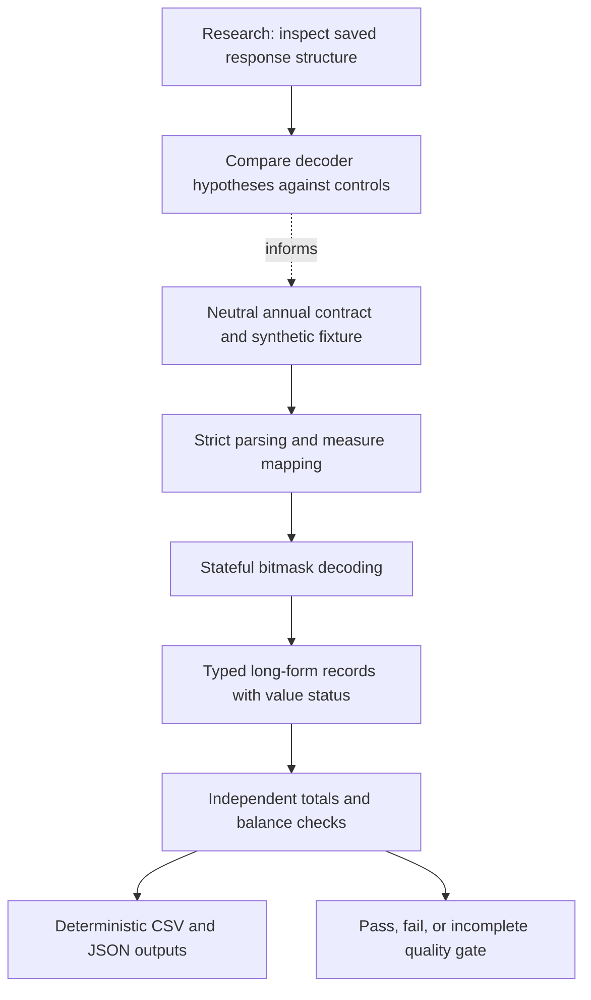

# Business Demography Analytics

An offline Python pipeline that turns compressed annual business counts into
auditable tables for analysis and BI reporting.

## Real-World Engineering Context

This repository is a sanitized, reproducible portfolio representation of a more
complex research workflow for interpreting compressed analytical responses.
The engineering challenge was establishing what the payload meant before
turning it into trustworthy tables: inspecting nested structures and measure
descriptors, comparing competing decoder interpretations, aligning time axes,
and testing decoded values against independently supplied controls.

The original notebooks include programmatic HTTP request experiments, saved
response inspection, tabular transformations, spreadsheet exports, and
reconciliation diagnostics. The inspected HTTP experiments contain recorded
errors; they do not establish a reliable live collector. The supported
reverse-engineering claim is response-schema and compression analysis, not a
verified endpoint-discovery or production ingestion system.

The public implementation makes the validated annual decoding and quality-control
boundary explicit. It uses invented fixtures and a neutral contract rather than
distributing original responses or request configuration. Deterministic exports,
strict schema checks, and automated tests make this narrower implementation
reviewable without access to the original system.

See [engineering architecture and evidence boundaries](docs/architecture.md)
for the distinction between research experiments and executable capabilities.



The research nodes describe the design process; the runnable CLI starts at the
neutral annual contract. A library adapter is available for caller-verified flat
annual responses, without any live transport or source-specific configuration.

## Business problem

Counts of business openings and closures can inform market monitoring and
regional planning. Before these counts enter a dashboard, analysts need to know
whether categories add up, whether periods align, and whether unavailable values
have been mistaken for zero. This project makes those checks explicit.

## Workflow

1. Read a documented compact annual-data contract.
2. Decode per-measure repetition while keeping detail and subtotal state separate.
3. Produce one record per group, year, and measure, retaining value status.
4. Compare detail with declared group, annual, and grand totals.
5. Check `balance = openings - closures` independently at every level.
6. Export detail, aggregates, and reconciliation exceptions for BI consumption.

The pipeline never fills missing values or adjusts numbers to make totals agree.
An incomplete check is not a passing check. Negative net balance is permitted;
negative opening or closure counts are flagged.

## Run locally

Use Python 3.10 or newer from this project directory. There are no third-party
runtime or test dependencies, network calls, API keys, or downloaded models.

```sh
python -B -m unittest discover -s tests -v
python -B run_pipeline.py --input data/sample/annual_counts.json --output outputs/sample
```

`requirements.txt` documents the dependency-free setup. A virtual environment is
optional. The `-B` flag avoids creating bytecode files.

The CLI returns `0` when all checks pass, `2` when any check fails or is incomplete,
and `1` for malformed input or an I/O error. Failed and incomplete validations
still produce reports. Review `validation.json` before consuming any CSV.

## Included demonstration

**All bundled data is invented.** It describes three fictional groups across
2021–2023. It demonstrates zero counts, negative balance, repeated individual
measures, full-vector repetition, and state carried across group boundaries.
It is not an anonymized real dataset and supports no real-world business claims.

The sample produces 27 detail records and 43 passing checks. Its expected
three-year totals are 32 openings, 16 closures, and a net balance of 16.
These are fixture expectations, not performance or accuracy metrics.

| Output | Purpose |
| --- | --- |
| `annual_detail.csv` | Group/year/measure values and observed, repeated, or unavailable status |
| `declared_totals.csv` | Input controls kept separate from calculated aggregates |
| `annual_summary.csv` | Detail-derived yearly values, known partial sums, and coverage counts |
| `reconciliation.csv` | Group, annual, grand-total, and identity checks |
| `validation.json` | Overall gate, check counts, and input content hash |

Exports are UTF-8, use fixed row order and line endings, and contain no timestamps
or machine-specific paths. Identical input bytes produce identical output bytes.
CSV blanks represent unavailable values; use the status and coverage columns
instead of importing blanks as zero. Counts have no monetary units. Balance is
an event-flow measure, not the stock of active businesses or a survival rate.

## Implementation

- `src/business_demography/decoder.py`: strict contract and typed records.
- `adapter.py`: optional structural adapter for an inspected flat annual response.
- `validation.py`: independent totals, arithmetic identities, and annual summary.
- `pipeline.py`: deterministic file exports and command-line entry point.
- `tests/`: offline decoder, adapter, transformation, validation, and CLI tests.
- `docs/`: input semantics and validation limitations.

Technology: Python standard library, JSON, CSV, dataclasses, and unittest.
The long-form exports can feed spreadsheets, SQL models, or BI dashboards.

## Limitations

Only flat annual axes and three explicitly mapped measures are supported.
Quarterly, nested, and undocumented compression formats are rejected. The
optional adapter requires a caller-verified measure mapping; it does not infer
business definitions from labels. The public sample is synthetic and there is
no live extraction feature. Passing arithmetic checks establishes internal
consistency, not source accuracy, representativeness, or causal conclusions.

See [the input contract](docs/input-contract.md) and
[validation findings](docs/validation.md) before adapting the pipeline.
